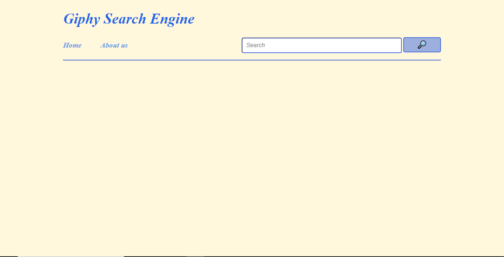
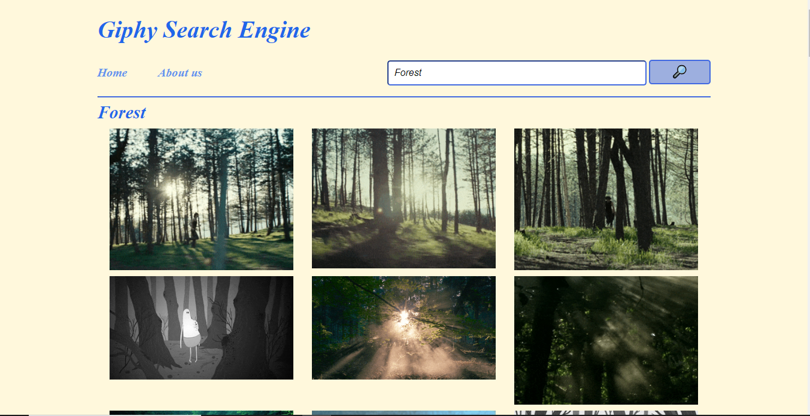
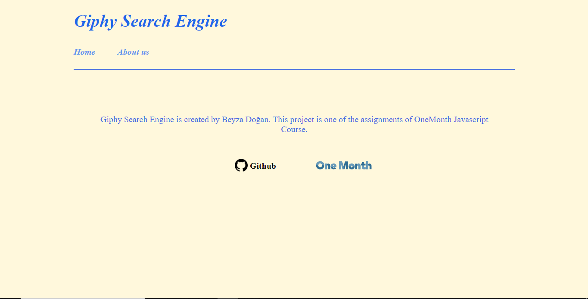

#GIPHY SEARCH ENGINE

**I created a website for searching various giphs about an specific topic.** 
I used [Giphy](giphy.com) API for this project. [Giphy](giphy.com) allows us to access their data with using an API for free.
I want to displayed the requested giphs without refreshing the page, so I made *AJAX* request for this. 

##How Giphy Search Engine works:
- This is the UI of main page: 

- The user enters a keyword about what kind of giphs he/she looks for. Then user clicks the button or enter key to see the giphs. The keyword is also displayed with the gipshs on the page as in the UI.

- This is the UI of about us page:

##How to use Giphy API:
In [Giphy](giphy.com) website, there is a detailed documentation about how to use Giphy API but I will briefly explain how I used it.
- There is an URL that I have to add my project to acces to the data. 
- Each URL has an unique API Key.
- I signed up to the [Giphy](giphy.com). Then I navigated to the [Giphy Developers](developers.giphy.com/docs/) section.
- I clicked to the *Create an App* button to get the API Key.

##AJAX
AJAX stands for Asynchronous JavaScript and XML. AJAX enables data to be sent and received to and from a database/server.
Data is grabbed with AJAX request.

